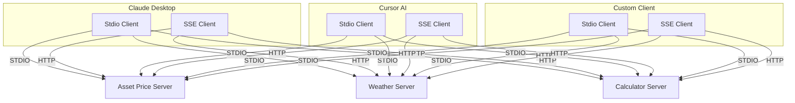
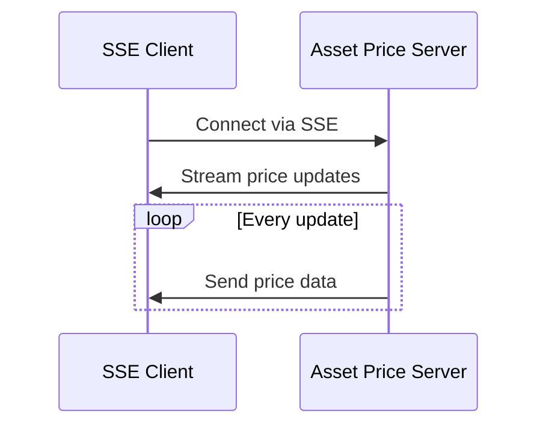
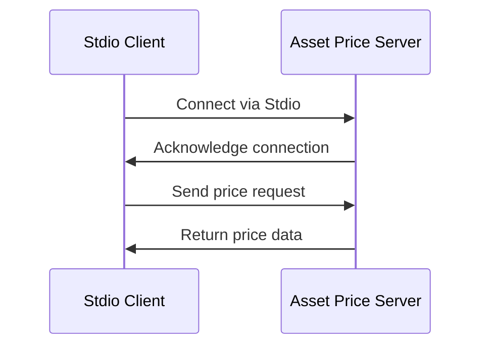

# Try FastMCP

A Python project demonstrating the use of FastMCP (Message Channel Protocol) for real-time data streaming and communication between client and server components.

## Overview

This project implements a FastMCP-based system with both client and server components, providing real-time data streaming capabilities for:
- Asset price data
- Weather information
- General message passing

## Architecture



## Project Structure

```
src/
├── mcp_client/           # Client-side implementations
│   ├── sse_client.py     # Server-Sent Events client
│   └── stdio_client.py   # Standard I/O client
└── mcp_server/          # Server-side implementations
    ├── asset_price.py    # Asset price data server
    ├── weather_mcp.py    # Weather data server
    ├── fetcher.py        # Data fetching utilities
    └── cal_server.py     # Calculator server
```

## Dependencies

- Python >= 3.11
- fastmcp >= 0.4.1
- websocket-client >= 1.8.0
- websocket >= 0.2.1
- price-loaders (from custom git repository)

Development dependencies:
- isort >= 6.0.1

## Installation

1. Clone the repository:
```bash
git clone <repository-url>
cd try-fastmcp
```

2. Create and activate a virtual environment:
```bash
python -m venv .venv
source .venv/bin/activate  # On Windows: .venv\Scripts\activate
```

3. Install dependencies:
```bash
pip install -e .
```

## Usage

### Hosting Asset Price Server

1. Start the Asset Price Server:
```bash
python -m src.mcp_server.asset_price
```

The server will start and listen for connections on the default port.

### Connecting with SSE Client



1. Start the SSE Client:
```bash
python -m src.mcp_client.sse_client
```

2. The client will automatically connect to the server and start receiving real-time price updates.

### Connecting with Stdio Client



1. Start the Stdio Client:
```bash
python -m src.mcp_client.stdio_client
```

2. The client will establish a connection and allow you to:
   - Request specific asset prices
   - Subscribe to real-time updates
   - Unsubscribe from updates
   - Close the connection

### Server Components

The project includes several server implementations:

1. **Asset Price Server**: Streams real-time asset price data
2. **Weather Server**: Provides weather information and alerts
3. **Calculator Server**: Basic calculation functionality

### Client Components

Two types of clients are implemented:

1. **SSE Client**: Uses Server-Sent Events for real-time data streaming
2. **Standard I/O Client**: Uses standard input/output for communication

## Development

To contribute to this project:

1. Install development dependencies:
```bash
pip install -e ".[dev]"
```

2. Follow the project's coding standards and use `isort` for import sorting.

## License

This project is licensed under the MIT License - see the [LICENSE](LICENSE) file for details.

The MIT License is a permissive free software license originating at the Massachusetts Institute of Technology. It is a simple license that permits reuse within proprietary software provided all copies of the licensed software include a copy of the MIT License terms and the copyright notice.

## Contributing

Yes, it's open :) feel free to send me PR
